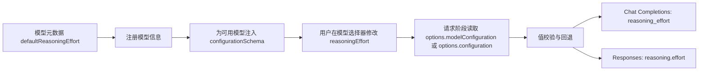

# Reasoning Effort 下拉配置实现指南

## 1. 目标

本指南用于在任意 AI 聊天类项目中实现模型选择器里的 Reasoning Effort 下拉配置，并将用户选择值正确映射到请求参数。

实现目标：

- 在模型具备该能力时展示 Reasoning Effort 下拉项。
- 支持默认值、用户覆盖值、非法值回退。
- 支持不同 API 协议下的参数映射。
- 具备清晰可测试的优先级规则。

## 2. 设计概览



核心思想：

- UI 层只负责选择值。
- 运行时统一做读取、校验、回退。
- 请求层按协议做字段映射。

## 3. 关键接口定义

建议先稳定以下接口，再写业务逻辑。

```ts
export type ReasoningEffortValue =
  | "none"
  | "minimal"
  | "low"
  | "medium"
  | "high"
  | "xhigh";

export interface ModelDescriptor {
  id: string;
  name: string;
  supportsReasoning?: boolean;
  defaultReasoningEffort?: string;
  configurationSchema?: {
    properties: {
      reasoningEffort: {
        type: "string";
        title: string;
        enum: readonly ReasoningEffortValue[];
        enumItemLabels?: readonly string[];
        enumDescriptions?: readonly string[];
        default: ReasoningEffortValue;
        group?: string;
      };
    };
  };
}

export interface RequestOptionsLike {
  modelConfiguration?: Record<string, unknown>;
  configuration?: Record<string, unknown>;
}
```

说明：

- `defaultReasoningEffort` 来自模型元数据，是默认回退值。
- `configurationSchema` 用于驱动模型选择器中的下拉 UI。
- `RequestOptionsLike` 兼容两类来源字段，降低宿主差异带来的耦合。

## 4. 实现步骤

### 4.1 定义合法值集合与校验函数

```ts
const REASONING_EFFORT_VALUES: readonly ReasoningEffortValue[] = [
  "none",
  "minimal",
  "low",
  "medium",
  "high",
  "xhigh",
];

export function isReasoningEffortValue(v: unknown): v is ReasoningEffortValue {
  return typeof v === "string" && REASONING_EFFORT_VALUES.includes(v as ReasoningEffortValue);
}
```

建议：

- 校验函数应在 UI 注入和请求写入两个阶段都使用。
- 不要只依赖类型系统，运行时必须防御非法输入。

### 4.2 构建可复用的下拉 schema

```ts
const BASE_REASONING_EFFORT_SCHEMA = {
  properties: {
    reasoningEffort: {
      type: "string",
      title: "Reasoning Effort",
      enum: REASONING_EFFORT_VALUES,
      enumItemLabels: ["None", "Minimal", "Low", "Medium", "High", "XHigh"],
      enumDescriptions: [
        "No reasoning budget",
        "Smallest reasoning budget",
        "Low reasoning budget",
        "Balanced reasoning budget",
        "High reasoning budget",
        "Very high reasoning budget",
      ],
      default: "medium",
      group: "navigation",
    },
  },
} as const;

export function createReasoningEffortSchema(defaultValue: ReasoningEffortValue) {
  return {
    properties: {
      reasoningEffort: {
        ...BASE_REASONING_EFFORT_SCHEMA.properties.reasoningEffort,
        default: defaultValue,
      },
    },
  } as const;
}
```

重点：

- 用工厂函数注入模型默认值，避免每个模型重复定义 schema。

### 4.3 在模型注册阶段按条件注入 schema

```ts
function attachSchemaIfSupported(model: ModelDescriptor): ModelDescriptor {
  const effort = model.defaultReasoningEffort;
  if (!model.supportsReasoning || !isReasoningEffortValue(effort)) {
    return model;
  }
  return {
    ...model,
    configurationSchema: createReasoningEffortSchema(effort),
  };
}
```

行为规范：

- 仅当模型支持 reasoning 且默认值合法时展示下拉项。
- 缺失或非法时不展示，避免误导用户。

### 4.4 请求阶段读取用户选择并回退

```ts
export function getConfiguredReasoningEffort(
  options: RequestOptionsLike | undefined,
  fallback: ReasoningEffortValue = "medium"
): ReasoningEffortValue {
  const candidate =
    options?.modelConfiguration?.reasoningEffort ??
    options?.configuration?.reasoningEffort;

  if (isReasoningEffortValue(candidate)) {
    return candidate;
  }
  return fallback;
}
```

读取优先级：

1. `modelConfiguration.reasoningEffort`
2. `configuration.reasoningEffort`
3. `fallback`

### 4.5 按协议映射请求参数

#### Chat Completions 风格

```ts
requestBody.reasoning_effort = resolvedEffort;
```

#### Responses 风格

```ts
requestBody.reasoning = {
  ...(isPlainObject(requestBody.reasoning) ? requestBody.reasoning : {}),
  effort: resolvedEffort,
};
```

原则：

- Chat Completions 使用顶层字段 `reasoning_effort`。
- Responses 使用对象字段 `reasoning.effort`。
- Responses 需保留已有 reasoning 子字段，避免覆盖别的配置。

## 5. 参数优先级建议

推荐从高到低：

1. 用户在模型选择器当前会话选择值（合法时）。
2. 模型默认值。
3. 系统默认值（建议 `medium`）。

如果系统有 `extra/advanced` 参数层，建议将其定义为最终覆盖层，并在文档中明确：

- `extra.reasoning_effort` 可覆盖顶层 `reasoning_effort`。
- `extra.reasoning.effort` 可覆盖 `reasoning.effort`。

## 6. 常见坑与防护

1. 只在 UI 层做校验，导致非法值进入请求体。
2. Responses 模式直接赋值 `reasoning`，覆盖了已有 `summary`、`exclude` 等字段。
3. 类型定义过宽（`string`）且无运行时兜底。
4. 不同 Provider 接受值不一致（例如 `none`、`xhigh`）。

防护建议：

- 请求前强制调用 `isReasoningEffortValue`。
- 对不支持的值做 provider 级映射或降级。
- 将非法输入记录到日志，便于问题定位。

## 7. 最小可用示例

```ts
function applyReasoningEffort(
  requestBody: Record<string, unknown>,
  options: RequestOptionsLike | undefined,
  modelDefaultEffort: string | undefined,
  apiMode: "chat-completions" | "responses"
) {
  const fallback = isReasoningEffortValue(modelDefaultEffort)
    ? modelDefaultEffort
    : "medium";

  const resolved = getConfiguredReasoningEffort(options, fallback);

  if (apiMode === "chat-completions") {
    requestBody.reasoning_effort = resolved;
    return;
  }

  const current =
    requestBody.reasoning && typeof requestBody.reasoning === "object" && !Array.isArray(requestBody.reasoning)
      ? (requestBody.reasoning as Record<string, unknown>)
      : {};

  requestBody.reasoning = { ...current, effort: resolved };
}
```

## 8. 测试清单

1. 模型默认值合法时展示下拉项。
2. 模型默认值非法时不展示下拉项。
3. 用户选择合法值后，请求体映射正确。
4. 用户选择非法值时回退到模型默认值。
5. 模型默认值缺失且用户值非法时回退到系统默认值。
6. Responses 模式下不会丢失已有 reasoning 子字段。
7. `extra` 覆盖策略符合预期。

## 9. 迁移建议

如果你要在另一个项目复用该能力，建议按下面顺序落地：

1. 先实现第 3 节接口与第 4.1 节校验函数。
2. 再接入第 4.2/4.3 节让 UI 出现下拉项。
3. 最后实现第 4.4/4.5 节请求映射。
4. 用第 8 节测试清单做回归。

这样可以最小化对现有请求层和模型注册层的侵入。
